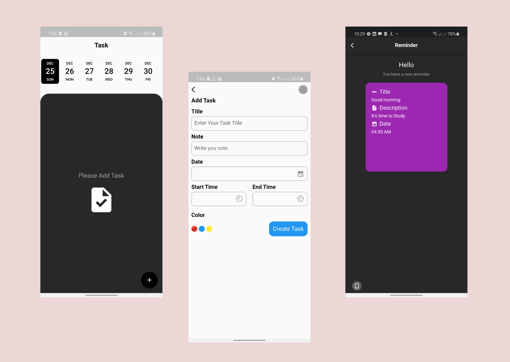
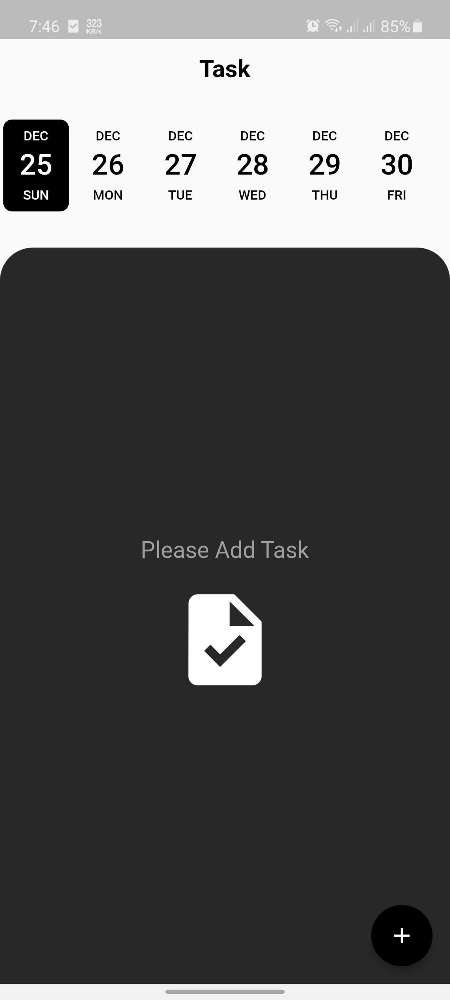
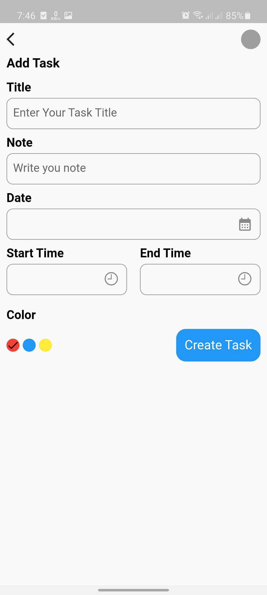
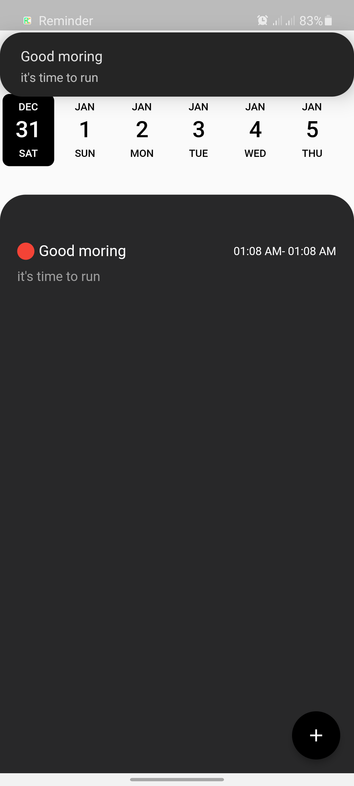
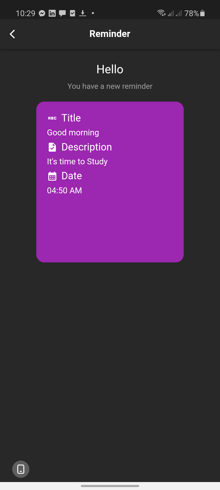

<!-- PROJECT LOGO -->
 

  <!--  -->

## **Task Manager**
  

    Reminder is a android app that help to Reminder your activities and easily help to keep updated your Daily activities 
     
    

  
      

    <a href="https://github.com/RootHex200/Reminder_App/issues">Report Bug</a>
    ·
    <a href="https://github.com/RootHex200/Reminder_App/issues">Request Feature</a>
  

<!-- TABLE OF CONTENTS -->

  
Table of Contents

  <ol>
    <li>
      <a href="#about-the-project">About The Project</a>
      <ul>
        <li><a href="#features-with-snapshots">Features with Snapshots</a></li>
        <li><a href="#built-with">Built With</a></li>
      </ul>
    <li><a href="#roadmap">Roadmap</a></li>
   
  </ol>

<!-- ABOUT THE PROJECT -->
## About The Project

 
Reminder is android version app that save task and help to updated daily activities easily.The app was made with Flutter as a Frontend Technology.This app help those people who want to keep updated.

(<a href="#top">back to top</a>)

## Features with Snapshots

2. home page with all activities
   

snapshot

     
   

3. Create New task 
   

snapshot

   

   

4. Notification 
   

snapshot

   

   

4. Reminder Page 
   

snapshot

   

   

## Built With 
#### Frontend Technology  
* [Flutter](https://flutter.dev/?gclsrc=ds&gclsrc=ds)  
Features and Plugins I've used: 
   - Isolate
   - Isar
   - local notification
   - Riverpod
   
   
* Demo video link: https://drive.google.com/file/d/1ODVjkPCg4NZh6p-tkTO-3l3CIchdnkp-/view?usp=share_link
* Play-store link: https://play.google.com/store/apps/details?id=work_manager.sabitur

(<a href="#top">back to top</a>)

## Prerequisites
There are some prerequisites to run this app and server

######
* **Flutter**

  Flutter has a greate [documentation](https://docs.flutter.dev/get-started/install) for enviroment setup 

## Roadmap
#### Frontend
- [x] Create 4 screen. 
  - [x] first screen is splash screen
  - [x] second screen is home screen 
  - [x] third screen is create a new activities screen
  - [x] four screen is reminder screen 
- [x] Home screen show all activities, activities data get from isar database with the help of Isolate by specific date and Activities data deleted from isar database
- [x] Create Activities screen data save in isar database with the help of Isolate and added schedule notification with save data id
- [x] activities screen, when user click in notification then show activities screen with notification payload
- [x] previous date data deleted from isar database when user not deleted data
- [x] when user delete new save data , then notification is cancel of deleted data

# MORE FEATURES IS UNDER DEVELOPING

(<a href="#top">back to top</a>)

